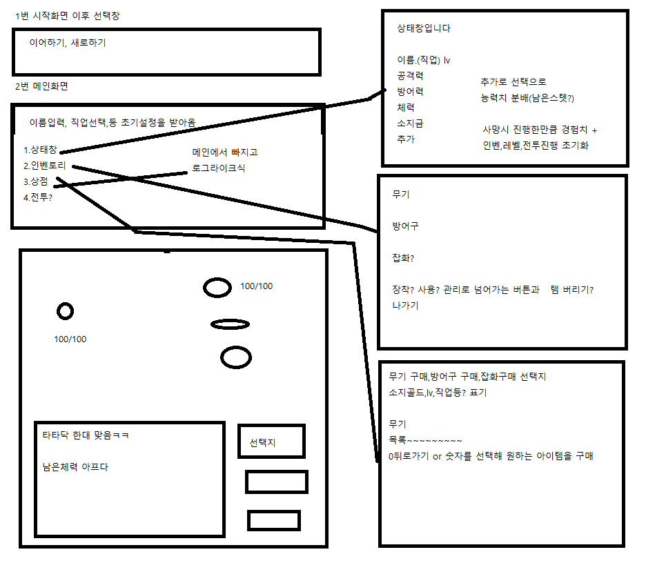

# Text_Dungeon 텍스트rpg 게임 프로젝트

 

## 팀원: 김윤진(팀장), 임석창, 서승우, 유선재, 김태형, 김국민

> C# 콘솔로 개발한 Text Rpg 게임 프로젝트 입니다.  
> 6인 팀 프로젝트이며, 개인 프로젝트를 기반으로 개발한 내용입니다.  
> 소통과 협업을 위주로 개발하였고, 개발 기간은 6일입니다.  
> 구현된 내용은 다음과 같습니다.

 

## 주요 기능

* 배경 음악

* 게임 시작 화면
    * 인트로
    * 새로하기, 이어하기 
    * 사용자 이름 입력
    * 직업 선택

* 게임 진행 화면
    * 메인화면
    * 상태보기
    * 인벤토리
    * 던전입장

## 기능 세부 설명
* 게임 시작 / 게임 시작 화면  
    * 인트로에서 게임스토리 진행
    * 상태보기, 인벤토리, 던전입장 으로 구성된 메인화면  
    * 배경 음악  
    
* 게임 진행(상태보기)  
    * Lv, 이름(직업), 공격력, 방어력, 체력, 마나, 소지금 을 확인할 수 있게 만들어져 있다.

* 게임 진행(인벤토리)
    * 소지한 아이템의 목록이 나오며 장착 관리를 눌러 장착관리 탭으로 이동가능하다.
    * 장착관리 : 원하는 아이템의 번호를 눌러 장착 및 해제가 가능하다.
    * 장착관련 : 각 아이템의 타입이 존재하며 같은 타입의 아이템은 1개씩만 장착 가능하다. \
        -예) Type.weapon 장착선택시 같은 타입인 Type.weapon은 모두 해제. 
  

* 게임 진행(던전입장)
    * 총 3메인스테이지로 구성된 던전을 로그라이크의 형식으로 진행가능하다.
    * 1스테이지 들판, 2스테이지 동굴, 3스테이지 협곡
    * 각각의 스테이지는 총 N개의 서브스테이지가 존재하여 진행하는 방식이다.  \
         -예) 1 - 1, 2 - 4, 3 - 7 등이 있다. 

##  기술 스택

## 와이어 프레임

![Figma] https://www.figma.com/file/ci5Bc4OVitoXVIYIytjFCW/TextDungeon?type=whiteboard&node-id=0-1&t=dWAUqRzXYUvTO4OC-0

## 시연 영상

[프로젝트 시연영상] https://www.

## 구현한 기능

### 게임 시작 화면

  

 

__새로하기, 이어하기__  

  

 

__이름 입력__

   

__직업 선택__  

 

__메인 화면__  

 

### 게임 진행 화면

 

__상태 보기__

  

 

__인벤토리__

  
 

__장착 관리__  

* 장착시 아이템 앞에 [E] 표시

* 아이템 스텟 반영

 

__던전__

    

## 프로젝트 시 일어난 문제와 해결  

### 프로젝트

__문제__:  
 

__결과__:  

### GitHub  

__문제__:  

main 과 개인branch 를 merge 한 뒤 오류로 인해 파일 손상.

__증상__:  
pull, push를 확인하지 않고 merge를 시키니깐 전에 작업한 내용이 사라지고 초기 상태로 롤백됬음.
Fork를 잘 사용하지 못해서 그랬다고 생각이 들어 튜터님과 함께 방법을 찾아냄.

__결과__:  
결국 익숙하지 않은 작업방식인 Fork를 뒤로하고 collaborate방식으로 전환함.
잘 못 merge된 main을 처음 베이스 작업하던 때로 돌려서 다시 시작하게됨.

## 프로젝트 소감

___김윤진___ 

ㅁ
 
___임석창___

ㅁ
 
___서승우___

 처음에는 뭐가뭔지 뭐부터 해야하는지 하나도 몰라서 나랑은 안맞나? 싶었습니다. 하지만 좋은 팀장님과 팀원분들의 잘 이끌어주신 덕분에 저도 이번 기회에 많은 것을 배웠습니다. 감사합니다.
 
___유선재___

 ㅁ
 
___김태형___

 ㅁ
 
___김국민___

 ㅁ
 
